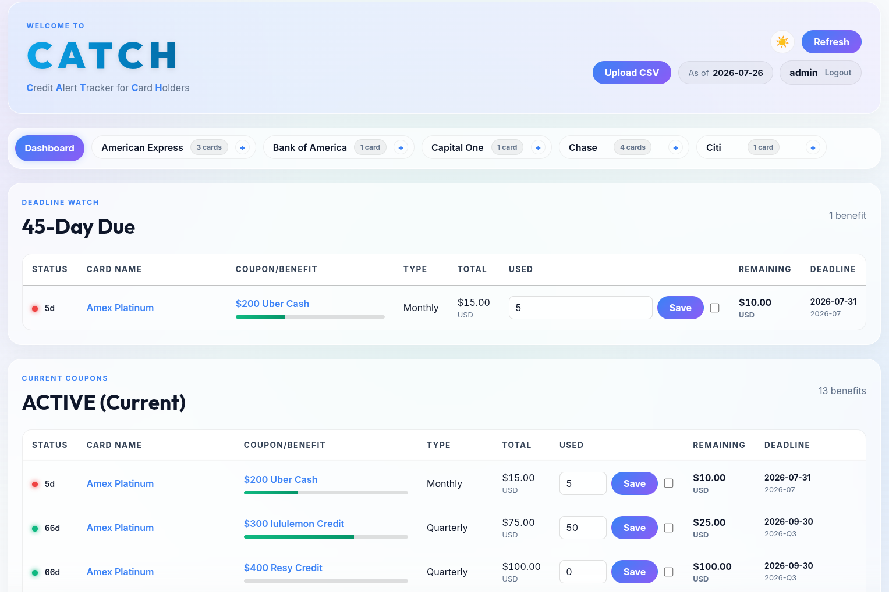
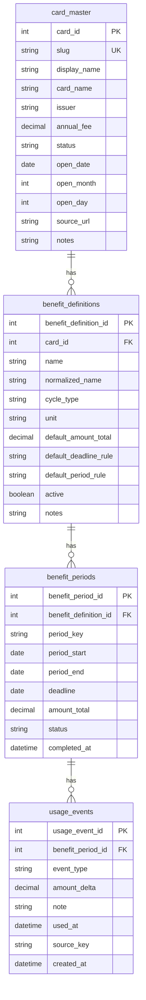
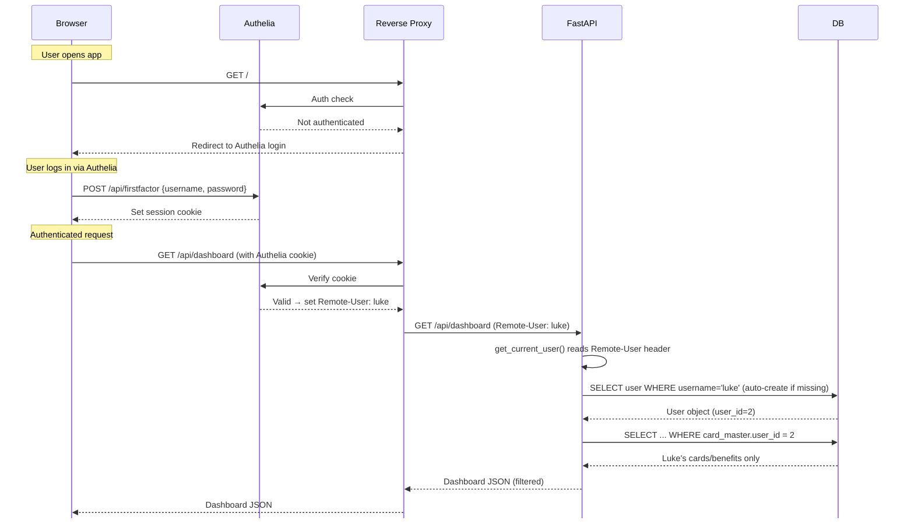

# Credit Card Benefits Tracker

A self-hosted FastAPI + MariaDB application for tracking credit card benefits, usage, and rollovers.



## Features

- SQLAlchemy models for the core runtime schema.
- Alembic configuration and schema migrations.
- MariaDB dump script using environment variables only.
- Multi-user authentication via reverse proxy (e.g. Authelia) reading the `Remote-User` header.
- REST API endpoints for dashboard reads, cards, benefit definitions, benefit periods, usage events, and admin rollover preview/apply.
- Static frontend shell served by FastAPI at `/`.
- Automated rollover cron entry point under `scripts/cron_jobs/`.
- CSV-based card import for adding new cards and benefits to a specific user.
- Pytest coverage for backend read, usage, and rollover behavior.

Database creation, user creation, and migration execution require explicit approval before touching MariaDB.

## Database Schema



## Database Setup & Initialization

This application requires an existing MariaDB server. Before starting the application, you must initialize the database, users, and tables. 

1. **Create the database and users** by running the provided SQL script against your MariaDB instance:
   ```bash
   mysql -h <your-database-host> -u root -p < scripts/init_db.sql
   ```

2. **Create the tables (Migrations)** using Alembic once your `.env` file is configured (see Local Setup):
   ```bash
   # If running locally:
   alembic upgrade head

   # Or if using Docker (after running docker-compose up -d):
   docker-compose exec credit-card-benefits alembic upgrade head
   ```

Alembic uses `MIGRATION_DATABASE_*` variables when provided, otherwise it falls back to the runtime `DATABASE_*` variables. The initial migration creates the core app tables plus Alembic's `alembic_version` tracking table.

## Local Setup

```bash
python3 -m venv .venv
. .venv/bin/activate
pip install -r requirements.txt
cp .env.example .env
```

Fill `.env` with your MariaDB credentials. The current local `.env` was generated during initialization and is ignored by git.

## Docker Deployment

To start the application using Docker Compose:

```bash
docker-compose up -d
```


If you modify the source files (like HTML, CSS, or Python scripts), you must rebuild the image for changes to take effect:

```bash
docker-compose up -d --build
```

## Adding Cards via CSV

Once your database is running and tables are created, you can easily populate your database using the provided CSV import script.

1. **Create a CSV file:** Create a CSV for the card you want to add (e.g., `Chase_Sapphire.csv`). The CSV should contain the card fields and benefit definitions.
2. **Preview the import:**
   ```bash
   docker-compose exec credit-card-benefits python scripts/import_card_csv.py preview --csv "your_csv_file.csv" --user-id 1 --pretty --details
   ```
3. **Apply the import:**
   ```bash
   docker-compose exec credit-card-benefits python scripts/import_card_csv.py apply --csv "your_csv_file.csv" --user-id 1 --yes --pretty
   ```

*Note: You do **not** need to manually run the rollover script (`month_start_rollover.sh`) after importing a brand new card. The CSV import script automatically handles creating the initial current benefit periods for you!*

## Backend API

Start the local API:

```bash
DATABASE_HOST=127.0.0.1 uvicorn app.main:app --reload --host 0.0.0.0 --port 9211
```

When running `uvicorn` directly on the host, set `DATABASE_HOST=127.0.0.1` because MariaDB is published on the host port. When running this app through Docker Compose, the compose file overrides `DATABASE_HOST=mariadb` for the container network.

Implemented runtime endpoints include:

- `GET /api/auth/me`
- `GET /api/health`
- `GET /api/dashboard`
- `GET /api/cards` and `GET /api/cards/{card_id}`
- `DELETE /api/cards/{card_id}`
- `GET /api/benefit-definitions` and `GET /api/benefit-definitions/{definition_id}`
- `DELETE /api/benefit-definitions/{benefit_definition_id}`
- `GET /api/benefit-periods` and `GET /api/benefit-periods/{period_id}`
- `GET /api/benefit-periods/{period_id}/usage-events`
- `PATCH /api/benefit-periods/{period_id}`
- `POST /api/benefit-periods/{period_id}/complete`
- `POST /api/benefit-periods/{period_id}/reopen`
- `POST /api/benefit-periods/{period_id}/usage-events`
- `POST /api/benefit-periods/{period_id}/usage-adjustment`
- `POST /api/admin/rollover/preview`
- `POST /api/admin/rollover/apply`

Usage totals returned by the API are derived from `usage_events`. Response amount fields are JSON numbers converted from backend `Decimal` values at the API boundary. `GET /api/dashboard` returns backend-prepared sections for the frontend. Rollover apply remains loopback-only when `ADMIN_LOCAL_ONLY=true`. All read/write operations enforce multi-user isolation by implicitly filtering for the `user_id` provided by the authentication dependency.

## Authentication (Authelia & Nginx Proxy Manager)

The backend natively supports authentication via reverse proxy (e.g. Authelia + Nginx Proxy Manager).
It reads the `TRUSTED_PROXY_HEADER` (default: `Remote-User`) to verify the logged-in user.

1. Configure Nginx Proxy Manager to use `auth_request` to Authelia.
2. Set the `Remote-User` header to the username returned by Authelia.
3. The application will seamlessly isolate data to the logged-in user and auto-provision users on first login.

### Single-User Mode (No Proxy Required)

If you are deploying this for personal use and do not want to set up Authelia, you can bypass the proxy requirement entirely:
1. Copy `.env.example` to `.env`.
2. Ensure `APP_ENV=dev` is set in your environment or Docker container.
3. Define `DEV_DEFAULT_USER=admin` (or any username) in your `.env`.

When `APP_ENV=dev`, the application will automatically fall back to logging you in as the `DEV_DEFAULT_USER` if no proxy headers are present. This allows you to use the app immediately as a standard single-user application!

## Architecture Diagram



## Scheduled Jobs (Cron)

### Benefit Rollovers

Preview a specific month without writing:

```bash
ROLLOVER_MODE=preview ROLLOVER_MONTH=2026-08 ROLLOVER_PRETTY=1 scripts/cron_jobs/month_start_rollover.sh
```

Apply a specific month manually:

```bash
ROLLOVER_MONTH=2026-08 scripts/cron_jobs/month_start_rollover.sh
```

Cron can run the month-start wrapper directly. It creates only periods whose `period_start` falls in the target month, so monthly benefits run every month, quarterly benefits run in quarter-start months, calendar-year annual benefits run in January, and membership-year/anniversary benefits run when the card anniversary period starts. Re-running the same month is idempotent.

```cron
5 0 1 * * /path/to/credit_card_benefits/scripts/cron_jobs/month_start_rollover.sh >> /path/to/credit_card_benefits/month_start_rollover.log 2>&1
```

For advanced manual windows, call the Python entry point directly:

```bash
scripts/cron_jobs/rollover.py apply --window-start 2026-08-01 --window-end 2026-08-31 --only-periods-starting-in-window --yes --pretty
```

### Expiration Alerts

You can schedule the application to send email alerts to users when their benefit periods are expiring (by default, 15 days before the deadline).

Set up your SMTP configuration in `.env`:
```ini
SMTP_SERVER=smtp.example.com
SMTP_PORT=587
SMTP_USER=your_smtp_username
SMTP_PASSWORD=your_smtp_password
SMTP_FROM=alerts@creditcardbenefits.local
```

You can run the script manually:
```bash
scripts/cron_jobs/daily_expiration_alerts.sh --days-ahead 15
```

Or configure it to run daily via cron (e.g., at 8:00 AM):
```cron
0 8 * * * /path/to/credit_card_benefits/scripts/cron_jobs/daily_expiration_alerts.sh >> /path/to/credit_card_benefits/expiration_alerts.log 2>&1
```

## Tests

```bash
python -m pytest
```

Tests use an isolated SQLite database and do not connect to MariaDB.

## Backup

After credentials are configured:

```bash
scripts/backup_db.sh
```

Backups are written under `BACKUP_DIR` and ignored by git.
